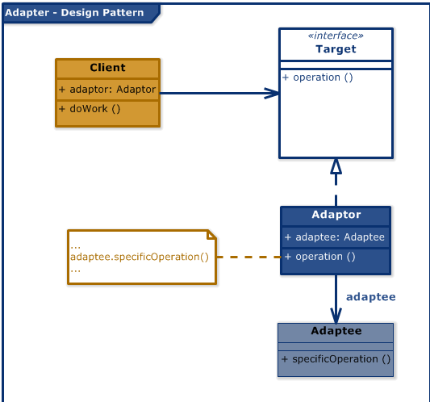

# Design Patterns

## Twisted: The Adapter Pattern

Object Oriented Programming allows reusing portions of existing code by creating new classes of objects which subclass another class, where the subclass inherits the behaviour of the superclass. However, inheritance can be abused easily which causes a problem in the software system. Twisted uses the **Adapter** Design Pattern to accomplish this. This entails receiving run-time instructions as to which algorithm to use in a family of algorithms [[1]](https://twistedmatrix.com/documents/current/core/howto/components.html).

The adapter pattern is a software design pattern that allows the interface of an existing class to be used as another interface, often used to make existing classes work with others without modifying the course code. Twisted supports delegation instead of inheritance where appropriate. This means asking another object to perform a task for the object at hand. To support this component design pattern, Twisted uses adapters, objects which implement an interface for another object type. The superclass-subclass relationship is said to be an *is-a* relationship [[2]](https://twistedmatrix.com/documents/current/core/howto/components.html) [[3]](https://twistedmatrix.com/documents/13.1.0/core/howto/design.html#auto1).



Classes and objects are involved and calls are made to the instance of the wrapped object. Examples of use can be seen in .

- [defer.py](https://github.com/twisted/twisted/blob/3d0be31827585ade5078624e17a1c15240eece02/src/twisted/internet/defer.py):

 ```python
 @classmethod
    def fromFuture(cls, future: Future) -> "Deferred[Any]":

        def adapt(result: Future) -> None:
            try:
                extracted = result.result()
            except BaseException:
                extracted = Failure()
            actual.callback(extracted)

        futureCancel = object()

        def cancel(reself: Deferred[object]) -> None:
            future.cancel()
            reself.callback(futureCancel)

        self = cls(cancel)
        actual = self

        def uncancel(
            result: _DeferredResultT,
        ) -> Union[_DeferredResultT, Deferred[_DeferredResultT]]:
            if result is futureCancel:
                nonlocal actual
                actual = Deferred()
                return actual
            return result

        self.addCallback(uncancel)
        future.add_done_callback(adapt)

        return self
 ```

Using the **Adapter pattern** above, the twisted codebase adapts L{Future} to a L{Deferred}. The code creates a L{Deferred} from a L{Future}, the user will need to call L{asyncio.ensure_future}, L{asyncio.loop.create_task} or create an L{asyncio.Task} yourself to get from a C{coroutine} to a L{Future} if what you have is an awaitable coroutine and not a L{Future} call.

One of the fundamental user requirements in Twisted, being flexible, is fulfilled by using the Adapter pattern. It also allows for the code to be clean as the client class is not required to use a different interface and can use polymorphism to swap between different implementations of adapters. However, sometimes adapter chains are required which can complicate the code as well [[4]](https://www.geeksforgeeks.org/adapter-pattern/). Adapters are used in different files and for different classes. Thus, **AbstractServer** and **AbstractClient** are used by all TCP, UNIX, SSL, UDP, UNIXDatagram, MultiCast servers and Clients respectively, and each of them reuse the , adhering to the Strategy Design Pattern.

Using the adapter pattern keeps the twisted codebase reusable and flexible. One of the fundamental user requirements, being flexible, is fulfilled by using the reactor pattern for Twisted. It also allows for the code to be clean as the client class is not required to use a different interface and can use polymorphism to swap between different implementations of adapters. However, sometimes adapter chains are required which can complicate the code as well [[4]](https://www.geeksforgeeks.org/adapter-pattern/). There is also a chance of **tight coupling** when an adapted object is required to explicitly construct an adapter. To counter tight coupling, components are used in addition to adapters [[5]](https://twistedmatrix.com/documents/21.2.0/api/twisted.python.components.html).

## Node.js

NodeJS is a runtime environment which is designed to be scalable. To wrap components that might have changes in different parts of the base, adapter pattern is used as a wrapper. The adapter pattern is a structural design pattern which can improve teh quality and scalability of the code, when used right. In JavaScript, *import* is used to import the adapter to the code being used. Alternately, adapters can also be written as functions instead of classes. In the NodeJS codebase, Adapters are used with classes, however, irresponsible use of the pattern can lead to multiple inheritance.

## Flask

Flask documentation indicates [Subclassing FlaskFlask](https://flask.palletsprojects.com/en/2.0.x/patterns/subclassing/), staying true to it's flexible behaviour, allows users to override or augment Flask’s internal functionality. Subclassing can be seen in the codebase for Flask according to the file demands. For instance, [conftest.py](https://github.com/SENG350UVic/flask/blob/main/tests/conftest.py) overrides the values for variables *testing* and *secret_key*. This requires some extra work from developers who want to modify and override default behaviour, but mitigating that work would hinder the flexibility requirement of the framework.
