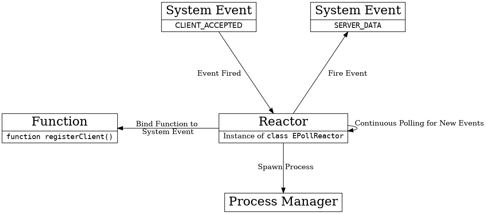

## Twisted

Twisted can be well-described as an event-driven architecture[[1]](#1).
The biggest strength of event-driven architectures lies in it's ability to work with many loosely-coupled components[[2]](#2). Different events need not know anything about each other, including when they were fired, what information they transferred, and whether or not they were deferred or completed. By providing multiple types of reactors, as well as the ability to create your own reactor, Twisted enables developers using the software to both completely abstract their workflow from the system's resources via a process manager, as well as take full control of how system resources are distributed. This style; however, does pose constraints as well. Events often cannot communicate with each other directly or call each other's functions, as deferred objects can only be called once[[3]](#3). In many cases, communication between such events can only be achieved via scheduled instances in the reactor that runs the event loop. This helps Twisted maintain it's event-driven paradigm: it is not built to forward the main process of handling events to an external source.

The above diagram outlining the event-driven architecture contains the types of modules in large text, one example of such module encapsulated in smaller text below, and actions performed which require one module to communicate with another module (some of these modules exist outside of the Twisted codebase). The developer assigns events to the reactor's queue, and system events are then interpreted by the reactor.

From the perspective of a developer using Twisted, they concern themselves with the assignment of events to the reactor as opposed to the order in which events are handled or the methods of delegating operations to system hardware. A process manager which is made up largely by the system handles these tasks.

<a id="1">[1]</a>
https://en.wikipedia.org/wiki/Event-driven_architecture

<a id="2">[2]</a>
https://web.archive.org/web/20161002141057/http://esocc2016.eu/wp-content/uploads/2016/04/Leymann-Keynote-ESOCC-2016.pdf

<a id="3">[3]</a>
http://aosabook.org/en/twisted.html