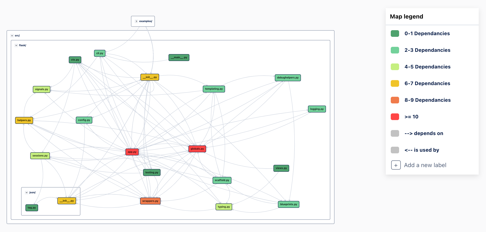

# Part 2 - Flask

## Architectural Style - Flask' Services and Micro Services

The [Flask][1] application is a micro web framework written in Python. Flask alone does not have many advanced features including, database abstractions, network protocols, or form validation, in contrast to other web frameworks like Node.js. Flask leaves these Architectural Decisions in the Developer's hands, only supporting them with plugins. With this said, the developers at Flask constrain this application to fit the micro description, meaning extensive and straightforward. The Services and Microservices CC diagram below shows how truly dense this application is on runtime. In the scenario below, an example web app in the Examples directory uses the Flask Framework.

## Connector & Component (CC) Diagram

**Figure X. CC Diagram of the Flask Runtime**

## About the Architectural Style

Flask's Architectural Style is compact, dense, and fixed. The CC runtime diagram reflects this style, as there are relatively few components, and each component is highly connected. Also, these connections are not distributed evenly throughout the system, as some "God Class" like modules have much more dependencies than others. However, this style achieves the Framework's goal by serving the sole purpose of connecting macroscopic components and plugins, all while being lightweight and functional. Developers who use Flask do not intend to modify the Framework itself and expect that it is functional. Since this Framework is small and straightforward, the Flask Developer can more easily guarantee functionality, as there is less code and modules that bugs or defects could manifest. Although Software Architects expect modularity, Flask makes up for this with extensive documentation, instructions, and ease of use. There is a clear trade-off of Modifiablity with Usability. Hence, changes to this system are highly constraint with this design. As mentioned before, the point of a framework is to offer consistency and should not change on a user-to-user basis. This constraint achieves their goal of usability as it allows for a high flexibility on the macroscopic level and eases the Developer's concern for the functionality on the microscopic level.

[1]: https://flask.palletsprojects.com/en/2.0.x/ "Flask Documentation"
